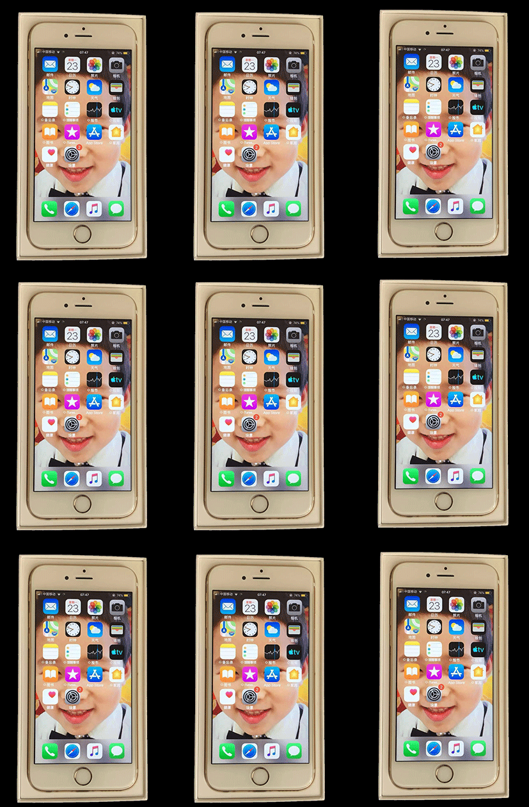

# 学习前提
### 计算机常见操
- 打开关闭文件
- 安装软件
- 了解和查看文件扩展名
    - 在windows系统中,扩展名是用来标示文件格式的一种标志,作用是让系统决定当用户想打开这个文件的时候用哪种软件运行
    - Windows中查看扩展名:文件夹-->查看-->将文件扩展名的选项勾选上    

### 会使用浏览器
- 常见浏览器
    - Chrome
    - IE
    - Safari
    - Opera
    - FireFox
    - 其他
- 浏览器统计网站
    - [statcounter](http://gs.statcounter.com/)
    - [baidu](https://tongji.baidu.com/data/browser)

### 会使用一款编辑器
-  编辑器就是用来编写代码的软件,常用的编辑器有
    - sublime(推荐使用)
    - vim
    - atom
    - vscode
    - IntelliJ IDEA 
    - ...
-  sublime安装
[官网下载](http://www.sublimetext.com/)


### 任务
- 查看文件扩展名
- 安装Chrome浏览器
- 安装sublime编辑器

# 预热

### WEB运行原理介绍 

[MDN参考](https://developer.mozilla.org/zh-CN/docs/Learn/Getting_started_with_the_web/How_the_Web_works)

前端就是编写各种个样精美的网页(PC和移动),一个网页由许多许多文件组成

### 新建扩展名为`.html`的文件,编写如下代码并在浏览器中运行
```html
<!DOCTYPE html>
<html lang="en">
<head>
    <meta charset="UTF-8">
    <title>测试页面</title>
</head>
<body style="color: red;font-size:32px;" onclick="this.style.color='yellow'">
    测试内容
</body>
</html>
```
### 以上代码用到的相关技术有:
- HTML(Hyper Text Markup Language)超文本标记语言,**负责页面内容的结构和语义**


- CSS(Cascading Style Sheet)层叠样式表,**责页面的风格和布局**


- JavaScript,一门解释性脚本语言,主要在浏览器中运行,**负责页面的行为**


### 任务
- 任意请求一个你喜欢的网站,在浏览器的控制台中的网络中观察都返回了哪些文件
- 编写以上预热代码,试着修改颜色和字体大小,在浏览器中运行并观察结果

# HTML
### 语法 
- 所有标签都在`<>`中
- 大多数标签有起始标签`<>`和结束标签`</>`,我们称为双标签
- 也有只有起始标签没有结束标签的,我们称为单标签
- 起始标签可以包括属性
    - 属性分为名称和值,名称和值用等号连接
    - 值一般包含在引号(单双引号均可)中
    - 多个属性用空格分隔
- 标签名不区分大小写,但推荐使用小写
- 注释
    - 格式:
    ```html
    <!--被注释的内容-->
    ```
    - 作用：注解代码,方便程序员之间的交流和自己今后阅读
    - 注意：注释不会在浏览器中显示,注释不能嵌套

### 常用标签
- `div`(division)标签,无实际语义,主要用来布局的
- `span`标签,无实际语义,主要用来布局的
- `input`标签
    - 作用:搜集用户信息
    - `name`属性,指定向服务器传输数据时的名字,服务器端的程序可以根据这个名字取到用户输入的数据
    - `type`属性,`type`属性有很多类型的取值, 取值的不同就决定了`input`标签的功能和外观不同
        - `type="text"`,明文输入框,`value`属性用来指定默认值,value属性的值是传给服务器的值
        - `type="radio"`,单选按钮
            - 天生是不互斥的,如果想互斥,必须要有相同的`name`属性
            - 可以给`input`标签添加一个`checked`属性,值也是`checked`,让单选框默认选中某一个
            - 如果属性的取值和属性的名称一样, 可以只写属性名称
- `img`(image)图像标签
    - 作用:告诉浏览器显示一张图片
    - `src`(source)属性用来指定图片的地址
        - 地址可以本地图片也可以是网络图片
        - 如果是网络图片要写全路径(从`http`开始写)
        - 如果是本地图片可以写相对路径
            - 相对路径,从执行文件(`.html`)所在的文件夹开始查找
                - 同级:资源文件和执行文件在同一个文件夹下
                    - 用法:直接写资源文件的名字 或者 `./`资源文件的名字(`./`表示当前文件夹)
                - 下级:资源文件存储在执行文件所在文件夹的子文件夹中
                    - 用法:从执行文件所在文件夹开始一层一层的写
                - 上级:资源文件存储在执行文件所在文件夹的父文件夹中
                    - 用法:`../`代表找到当前文件夹的上一级文件夹

### 任务
- 写一组单选按钮用来选择成绩的等级

- 在test.html中显示所有的图片
```
├── 3.jpg
└── a
    ├── 1.jpg
    ├── b
    │   └── 2.jpg
    └── test.html
```


# CSS
### 使用
- 行内样式
    - 用法: 把样式写在标签的`style`属性里面
    - 缺点: 重复代码多,维护困难

- 内部样式
    - 用法:把样式写在`style`标签里面
    - 缺点:只适用于当前页面
    - 注意点
        - `style`标签必须写在`head`标签里面
        - `style`标签中的`type`属性可以不用写, 默认就是`type="text/css"`
        - `style`标签中的样式设置有固定语法格式
    - 语法
        - 格式:
        

        - CSS有选择器和声明(一条或者多条)两部分组成
        - 花括号前面的是选择器,花括号里面的是声明
        - 每条声明由一个属性和一个值组成,属性和值用冒号分开
        - 每条声明用分号分开
        - 属性不同,值的设置方式也会有所不同
- 外部样式
    - 用法:把css写在一个外部文件里面,这个外部文件用`.css`作为扩展名,在需要使用的页面通过`link`标签引用即可。
    - 注意点
        - `link`标签要写在`head`标签内部
        - `link`标签的`href`属性指定外部css文件的地址,地址的使用和图片中地址的使用方法一样
        - `css`文件中不用写`style`标签
        - 这种方式也是项目中使用最多的一种方式

### 任务
- 使用不同的方法给多个文件添加css,修改css体会那种方式易于修改

### 选择器

选择器其实就是一套规定了选择页面上元素的**规则**。就是{}前面的部分。

### 类选择器
通过给标签添加class属性,然后通过这个属性找到该元素,为它设置样式
```css
.类的名称{
    属性: 值;
    属性: 值;
    ...
}
```
- 注意点
    - 必须以英文`.`开头，中间不能添加空格
    - 类名是可以重复的,也就是说同一个类名可以添加到不同的标签上
    - 类(class)是所有标签都有的属性,这个属性是专门用来添加样式的
    - 一个标签可以添加多个类,每个类中间用空格分开,格式：`class="class1 class2 ...."`
    - 类名的命名规范
        - 只能包括数字(0-9)，下划线(_)，英文字符(a-z)
        - 只能以下划线和英文字符开头，不能以数字开头,一般都是以英文字符开头
        - 类名不能是HTML标签的名字
### ID选择器
根据页面元素的ID找到该元素然后设置样式
```css
#ID的名称{
    属性: 值;
    属性: 值;
    ...
}
```
- 注意点
    - 必须以`#`号开头，中间不能添加空格
    - ID是唯一的，也就是说当前的页面上所有的ID不能重复
    - ID是所有标签都有的属性 
    - ID不是用来作为选择器添加样式的，它的主要作用是给JS使用
    - ID的命名规范
        - 只能包括数字(0-9)，下划线(_)，英文字符(a-z)
        - 只能以下划线和英文字符开头，不能以数字开头,一般都是以英文字符开头
        - ID名不能是HTML标签的名字
### 后代选择器
找到指定选择器的所有后代,然后给他们设置样式
```css
选择器1 选择器2{
    属性: 值;
    属性: 值;
    ...
}
```
- 注意点
    - 上述格式的意思就是先找到选择器1选中的元素,然后再找选择器1选中元素里面所有的选择器2选中的元素
    - 选择器和选择器之间至少有一个空格,一般就打一个空格
    - 除了标签之外,还可以写其他的选择器,比如类,ID
    - 后代选择器可以一直写下去
    - 后代选择器不仅仅可以找到它的直接后代(儿子),同时还可以找到它的孙子,重孙子。。。。。
### 子选择器
找到指定选择器的儿子元素,然后给他们设置样式
```css
选择器1>选择器2{
    属性: 值;
    属性: 值;
    ...
}
```
- 注意点
    - 上述格式的意思就是先找到选择器1选中的元素,然后再找选择器1选中的元素里面所有的儿子中被选中器2选中的元素
    - 选择器和选择器之间用`>`分隔
    - 除了标签之外,还可以写其他的选择器,比如类,ID
    - 子选择器可以一直写下去
    - 子选择器只能找到他的儿子

### 交集选择器
选中满足所有条件的集合,然后设置样式
```css
选择器1选择器2...{
    属性: 值;
    属性: 值;
    ...
}
```
- 注意点
    - 每个选择器中间不能添加任何字符
    - 选择器可以是标签,ID,类,但是标签必须放在第一个
### 并集选择器
找到每个选择器选中的元素,然后相加,再设置样式
```css
选择器1,选择器2...{
    属性: 值;
    属性: 值;
    ...
}
```
- 注意点
    - 各个选择器之间用,号分隔
    - 选择器可以是标签,ID,类
### 兄弟选择器
选择兄弟关系中的元素,再设置样式
#### 相邻兄弟选择器
```css
选择器1+选择器2...{
    属性: 值;
    属性: 值;
    ...
}
```
- 注意点
    - 各个选择器用`+`号隔开
    - 只能选择紧邻的那个元素
    - 如果中间有隔开元素,就不会被选中
    - 选择器可以是标签,ID,类
#### 通用兄弟选择器
```css
选择器1~选择器2...{
    属性: 值;
    属性: 值;
    ...
}
```
- 注意点
    - 各个选择器用`~`号隔开
    - 可以选中所有的满足条件元素
    - 不管中间有没有隔开元素,都会被选中
    - 选择器可以是标签,ID,类

### 通用选择器
选择页面上所有的元素,然后给他们添加样式
```css
*{
    属性: 值;
    属性: 值;
    ...
}
```
- 注意点
    - 通用选择器只做为了解,真实项目中用的不多
    - 因为它要选择页面上所有的元素,效率比较低,多用于测试
### 伪类选择器
针对标签的状态进行选择,然后添加样式 
#### 所有元素相关伪类选择器
- 选择器:hover,鼠标悬停时给元素添加样式

#### input相关伪类选择器
- 选择器:checked,input被选中时给元素添加样式

### 任务
- 熟练使用各种选择器

### 文字文本
- 文字的颜色`color`
    - 英文单词,英文单词表示颜色主要用来调试,实际开发中用的不多
    
    17 种标准色是 aqua, black, blue, fuchsia, gray, green, lime, maroon, navy, olive, orange, purple, red, silver, teal, white, yellow
    
    - rgb
        - rgb就是r(red)红 g(green)绿 b(blue)蓝的缩写，也就是咱们通常说的三原色。可以通过设置三原色的值来确定颜色。
        - R,G,B的取值范围0-255,0代表不发光，255代表该颜色最亮
        - 三原色的颜色设置一样的情况下可以调出灰色,值越大越灰,rgb(255,255,255)就是白色了
    - rgba
        - rgba中的rgb和上述的rgb的意思是一样的
        - rgba中的a(alpha)就是透明度，取值从0到1，0表示全透明，1表示不透明
    - 十六进制(Hex)
    
    十六进制是计算机中数据的一种表示方法,特点是逢16位向前进一位,取值从0-9 A-F

        - 表示颜色格式:#RRGGBB
            - 六位16进制数代表一个颜色
            - RR就是红色，GG就是绿色，BB就是蓝色
            - 当十六进制的每一个颜色的两位是相同的情况下可以简写,如#FF0000=#F00
            - 注意简写的条件是每一个颜色的两位的值要一样

- 水平对齐方式`text-align`
    - `left`(默认) 左对齐
    - `center` 居中对齐
    - `right` 右对齐

- 文字的大小`font-size`
    - 默认值取决于标签
    - 取值为 值+单位,常见的单位有
        - px(像素)
        - %(父元素字体的百分比)
        - em(一个em相对于一个父元素字体的大小)

### 盒模型

所有的HMTL标签都是一个盒子,他和咱们现实中的盒子是一样的,盒模型其实是现实生活中盒子的一个比喻



- 观察上图我们可以发现:          
    - 手机自身有自己高度和宽度(内容)
    - 手机和边框之间有一定的距离(内边距)
    - 手机盒子自身有一个边框(边框)
    - 手机盒子和手机盒子之间有一定的距离(外边距)    

- 盒模型组成

    

    - 内容(content):可以真正使用的部分,由元素的宽和高来决定,是真正可以填充内容的空间
        - 内容的设置
            - width
            - height
            - 取值可以是具体的像素也可以是百分比,百分比是相对于自己的父元素来说的
    - 内边距(padding):内容和边框之间的距离
        - 内边距的设置
            - padding:上 右 下 左;
            - 按照顺时针方向设置。
            - 如果省略了一个边,就取对边的值,如果只设置了一个边,那么所有的边都一样
    - 边框(border):围绕在元素四周的线条,边框有三要素,即宽度,样式,颜色
        - 边框的设置
            - border:宽度 样式 颜色
            - 颜色可以省略,默认的是黑色
            - 常见样式有dotted(点状),dashed(虚线),solid(实线)
            - 宽度可以省略，默认是3px
    - 外边距(margin):标签和标签之间的距离
        - 内边距的设置
            - margin:上 右 下 左;
            - 按照顺时针方向设置。
            - 如果省略了一个边，就取对边的值，如果只设置了一个边，那么所有的边都一样
    
- 盒子新增padding和border之后,如何保证盒子元素的宽度和高度不变
    - 方法一,通过计算并修改元素的内容的宽和高来实现
    - 方法二,添加box-sizing:border-box;
        添加border-box后元素的宽高包含padding和border ,元素的宽高恒等于width/height的值
    清除默认内外边距

- 清除默认内外边距
    ```css
    * {
        margin:0;
        padding:0;
    }
    ```
    - 为什么要清除默认内外边距?
        - HTML标签自身有默认默认的内外边距,这样不利于对盒模型空间的计算,为了解决这个问题,在实际的开发中需要清空默认的内外边距
        - 在不同的浏览器中,HTML的默认内外边距也不同,为了兼容不同的浏览器,在实际开发中需要清除默认内外边距

### 任务
- 用div写一个按钮

### 布局

网页布局就是对网页中各个元素进行**排版**

#### 标准流布局

标准流的网页布局是浏览器默认的排版方式,流可以理解为流式排列

- 标准流布局规则
    - 行内元素(如span),行内块状(如img/input)元素从左到右
    - 块状元素(如div)从上向下
    

#### 固定定位

参照`body`发生位置的移动,固定定位的元素不会随着滚动条的移动而移动

- 如何让一个元素成为固定定位的元素
    - 给元素添加上`position: fixed;`
    - 用`top|right|bottom|left`中的一个或者两个属性来设置移动距离
    - 注意点
        - 只写`position: fixed;`元素是不会发生任何移动的,需要配合设置四条边的移动距离来一起使用
        - 设置四条边的移动距离分别用 `top|right|bottom|left`
        - 固定定位元素是脱离标准流的,所以固定定位元素在标准流中的空间会被释放出来
        - 固定定位元素不会随着滚动条的移动而移动
        - 固定定位元素始终参考的都是body 
- 层级关系,决定元素的的显示前后
    - 设置层级关系
        - `z-index:数字` 
        - 值越大越在前

#### 任务
- 实现一个顶部固定导航栏

#### 弹性布局

弹性布局(Flexible Box),用来为盒模型提供灵活性布局方法

- 如何让一个元素成为弹性布局的元素
    - 给元素添加`display: flex;`
    - 指定了弹性布局的元素称为Flex容器(flex container),它的所有子元素自动成为容器成员,称为 Flex项目(flex item)
    - 容器属性
        - flex-direction 决定项目的排列方向
            - row(默认值):水平方向,起点在左端
            - row-reverse:水平方向,起点在右端
            - column:垂直方向,起点在上沿
            - column-reverse:垂直方向,起点在下沿
        - flex-wrap 决定项目一行排不下，如何换行
            - nowrap(默认值):不换行,元素的宽度按照指定宽的的比例从新计算
            - wrap:换行,第一行在上方
            - wrap-reverse:换行,第一行在下方
        - justify-content 决定项目的水平对齐方式
            - flex-start(默认值):左对齐
            - flex-end:右对齐
            - center:居中
            - space-between:两端对齐,项目之间的间隔都相等。
            - space-around:每个项目两侧的间隔相等。所以,项目之间的间隔比项目与边框的间隔大一倍。

#### 任务
- 实现一个四列水平布局,每列之间的间隙相等

### css3
#### 过渡

让元素的状态逐渐的发生变化

- 添加过渡的必要条件
    - 给需要过渡的元素添加`transition-property`属性来指定那个属性需要过渡,如果有多个属性同时变化,将多个属性用逗号隔开即可
    - 给需要过渡的元素添加`transition-duration`属性来指定过渡的执行时间,时间可以是秒(s)或者毫秒(ms),如果有多个属性同时变化,将过渡的执行时间用逗号隔开即可
    - 给需要过渡的元素添加一个触发事件(通常是hover),在事件中指定需要过渡的属性的变化值
    - 过渡复合样式的写法
        - 一组属性的每个属性用空格隔开
            - transition:需要过渡的属性 执行过渡的时间 执行过渡的速度 延迟时间;
            ```css
            transition:width 3s linear 2s;
            ```
        - 多组属性之间用逗号隔开
            - transition:需要过渡的属性 执行过渡的时间 执行过渡的速度 延迟时间,需要过渡的属性 执行过渡的时间 执行过渡的速度 延迟时间...;
            ```css
            transition:width 3s linear 2s,background-color 3s linear 2s;
            ```
        - 多个属性发生同样的过渡效果简写
            - 把多个属性简写为all
            ```css
            transition:all 3s;
            ```
    - 添加过渡的步骤
        - 布局页面
        - 触发修改属性
        - 给修改属性添加过渡效果

#### 2D转换

使元素在平面上改变形状、尺寸和位置的一种效果

- 旋转
    - 格式
    ```css
        transform: rotateX(ndeg);
        transform: rotateY(ndeg);
    ```
    n是一个具体的数字,deg代表度数的单位
- 平移
    - 格式
    ```css
        transform: translate(水平方向移动距离,垂直方向移动距离);
        transform: translateX(水平方向移动距离);
        transform: translateY(垂直方向移动距离);
    ```
    - 移动距离可以是负数,负数代表向反反向移动
    - 取值可以是百分比,百分比是相对于自己的宽高

- 缩放
    - 格式
    ```css
        transform: scale(水平方向缩放比例,垂直方向缩放比例);
        transform: scaleX(水平方向缩放比例);
        transform: scaleY(垂直方向缩放比例);
    ```
    - 缩放比例如果是1代表不变,大于1代表放大,小于1代表缩小
    - 如果水平和垂直方向上缩放比例一样,可以简写一个

#### 任务
- 实现当鼠标悬停到某个元素上时,让他的相邻兄弟元素沿着垂直方向移动
- 实现当鼠标悬停到某个元素上时,让他的子元素水平和垂直方向同时缩放

#### 动画
- 创建动画的步骤
    - 给需要执行动画的元素指定动画的名称,animation-name
    - 创建指定名称的动画,@keyframes
    - 给需要执行动画的元素指定动画的执行时间,animation-duration
- 过渡和动画的区别
    - 过渡需要人为的触发,而动画不需要
- 动画的其他属性
    - animation-timing-function:  linear|ease 默认的|ease-in|ease-out|ease-in-out|cubic-bezier(x1,y1,x2,y2);动画的执行速度,动画执行的速度和过渡的一样
    - animation-delay: 时间;延迟动画的执行,时间可以是秒或者毫秒
    - animation-iteration-count: 具体的数字(默认是1)|infinite(无限循环); 执行次数 
    - animation-direction: normal(默认状态不执行往返动画)|alternate(执行往返动画); 是否执行往返动画,如果是执行往返动画,返回执行也算一次动画
- 动画的复合样式写法
    - animation:动画的名称 动画的执行时间 动画的速度 延迟时间 动画的执行次数 是否执行往返动画;
    动画名称和执行时间不可以省略

#### 任务
- 实现当某个单选框被选中时,让他的相邻兄弟从不透明变到透明

#### 其他杂项
- opacity,规定不透明度。从 0.0 （完全透明）到 1.0（完全不透明）
- cursor:pointer,光标呈现为指示链接的指针（一只手）
- overflow: hidden,内容会被修剪，并且其余内容是不可见的
- background-color,设置背景色
- border-radius,设置边框圆角
